# Event Ticketing AI Platform

Real-time ticket validation platform focused on antifraud, high-concurrency validation, AI-assisted and rule-based risk scoring, and operator workflows.

---

## Vision

Build a production-grade event ticketing validation system beyond CRUD:

- real-time scan validation
- duplicate scan detection
- single-use ticket enforcement
- full scan audit trail
- AI-assisted risk scoring
- operator dashboard (Ops Center)
- mobile scanner app for field operations

---

## 🚀 What’s implemented

### Ticket validation engine
- Real-time validation API
- Duplicate scan detection
- Expired / cancelled / already-used ticket handling
- Concurrency-safe validation logic

### Antifraud & AI layer
- Rule-based risk scoring (0–100)
- Risk levels (Low / Medium / High)
- Fraud signals detection:
  - duplicate_scan
  - expired_ticket
  - already_used
  - multi_device
  - unknown_ticket

### AI explanation system
- OpenAI integration (optional)
- Automatic fallback (no dependency on external AI)
- Bilingual support (EN / FR)

### 🤖 Antifraud Agent

- Rule-based decision engine
- Actions:
  - NotifyOps
  - CreateIncident
  - RequireManualReview
- Deterministic and auditable decisions
- Integrated with risk scoring and AI explanations

### 🚨 Incident Management

- Automatic incident creation from agent decisions
- Incident lifecycle:
  - Open
  - In Progress
  - Resolved
- Assignment workflow
- Resolution tracking
- Full auditability for operations teams

### API layer
- Clean REST endpoints
- ProblemDetails error handling
- Integration-tested endpoints

### Dashboard backend
- KPI aggregation
- Scan history with filters
- Risk analysis endpoint
- Fraud scenario aggregation

### Frontend (Ops Center)
- React + Vite + Tailwind
- Dashboard with KPIs
- Scan history with advanced filters
- Risk analysis panel (AI + fallback)
- Agent decision logs
- Notifications system (badge + alerts)
- Incident management workflow:
  - list / filter
  - assign
  - resolve
- Ticket lookup
- Manual scan simulation
- Bilingual UI (EN / FR)

### 📱 Mobile Scanner (MAUI)
- Manual scan (ticket code input)
- Camera scan (QR / barcode)
- Real-time validation from backend API
- AI risk analysis integration
- Ticket lookup
- Recent scans monitoring
- Agent decision display
- Notifications badge
- Incident monitoring
- Assign / resolve incidents (field ops)
- Mobile-first UI (Blazor Hybrid)

---

## 🧠 AI & Risk Engine

Each scan produces:

- `RiskScore` (0–100)
- `RiskLevel` (Low / Medium / High)
- `RecommendedAction` (Allow / Monitor / ManualReview)
- `RiskSignals`

AI explanation:
- Uses OpenAI when quota is available
- Falls back to deterministic logic otherwise

---

## 🏗️ Architecture

- ASP.NET Core Web API (.NET 8)
- PostgreSQL + Entity Framework Core
- Clean Architecture (Domain / Application / Infrastructure / API)
- React frontend (Ops Center)
- .NET MAUI Blazor Hybrid mobile app
- InMemory + PostgreSQL interchangeable infrastructure

---

## 📡 API Overview

### Scan validation

POST /api/scans/validate

### Risk analysis

GET /api/scans/{id}/risk?lang=en|fr

### Dashboard

GET /api/dashboard/summary

### Scan history

GET /api/scans  
GET /api/scans/recent  
GET /api/scans/{id}

### Agent

POST /api/agent/analyze-scan/{id}

GET /api/agent/decision-logs

GET /api/agent/notifications
POST /api/agent/notifications/{id}/mark-read

### Incidents
Incident management endpoints for ops workflow.

GET /api/incidents
GET /api/incidents/{id}
POST /api/incidents/{id}/assign
POST /api/incidents/{id}/resolve

---

## 📊 Ops Center

Located in `/ops-center`

Features:
- KPI dashboard
- Scan history with filters
- Risk analysis panel
- Ticket lookup
- Manual scan simulation

---

## 📱 Mobile Scanner (MAUI)

Located in `/mobile/EventTicketingAiPlatform.Mobile.Scanner`

Designed for field agents to validate tickets in real-time.

### Features
- Dual scan modes:
  - Manual input
  - Camera (QR / barcode)
- Real-time validation
- Fraud detection & risk scoring
- AI explanation (OpenAI optional, fallback included)
- Ticket lookup
- Recent scans
- Agent decision display
- Notifications system (badge + alerts)
- Incident monitoring and workflow

### Technical
- .NET MAUI Blazor Hybrid
- ZXing.Net.Maui (camera scanning)
- Shared contracts with backend API

---

## 🧪 Demo Fraud Scenarios

The system includes realistic seeded scenarios:

- valid ticket
- expired ticket
- cancelled ticket
- already used ticket
- duplicate scans across devices
- unknown tickets

---

## ⚙️ Configuration

### Database

ConnectionStrings:DefaultConnection

### OpenAI (optional)

OpenAI__Enabled=true  
OpenAI__ApiKey=your_key

---

## 🛡️ Fault Tolerance

- OpenAI failures → automatic fallback
- API returns ProblemDetails
- Safe frontend rendering (no crashes on undefined data)

---

## 📸 Screenshots Web

### Dashboard
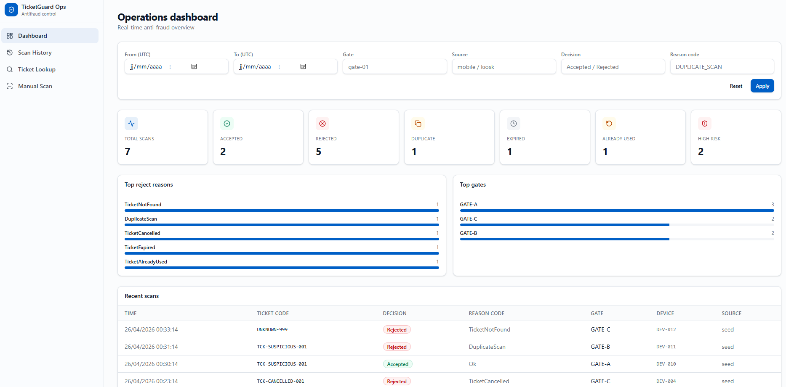

### Dashboard Recents Scans
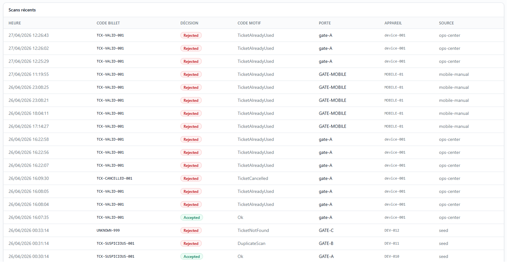

### Dashboard Decisions & Open Incidents
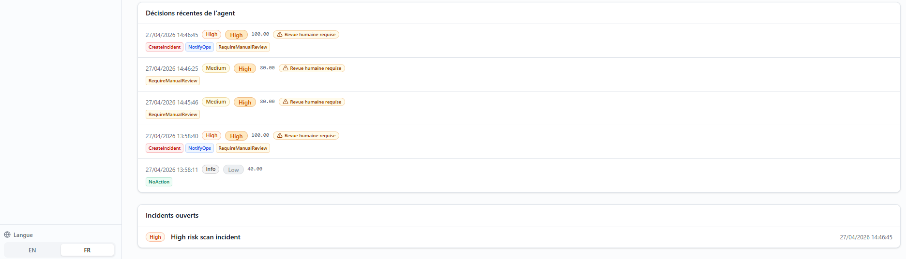

### Scan History
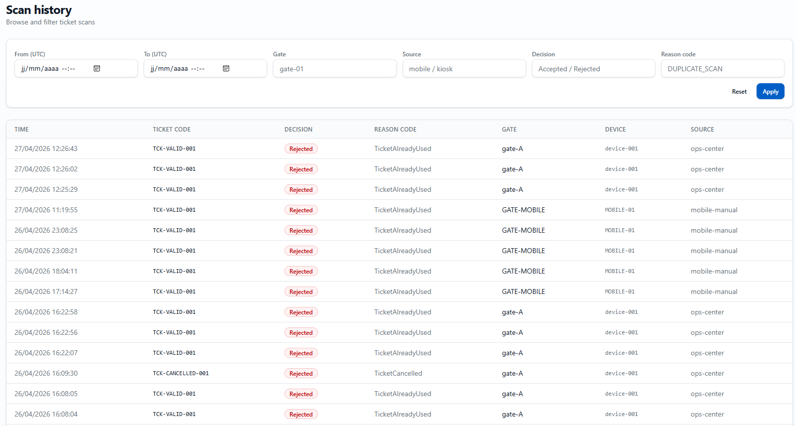

### Scan Details
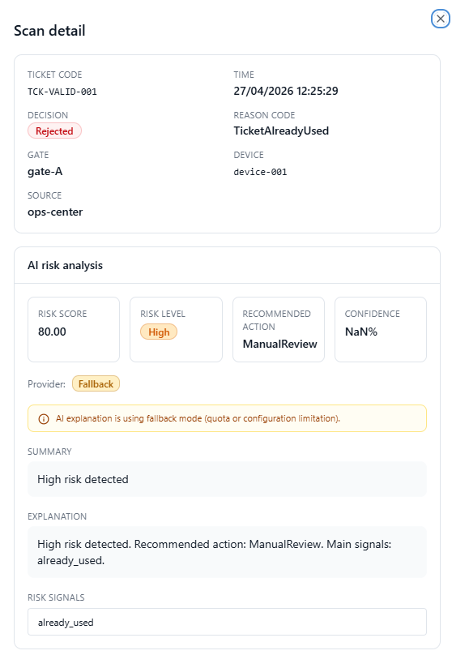

### Risk Analysis
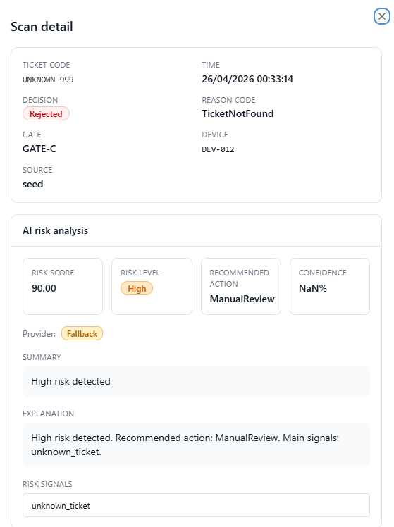

### Ticket Lookup
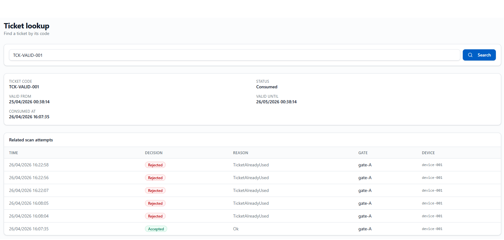

### Manual Scan
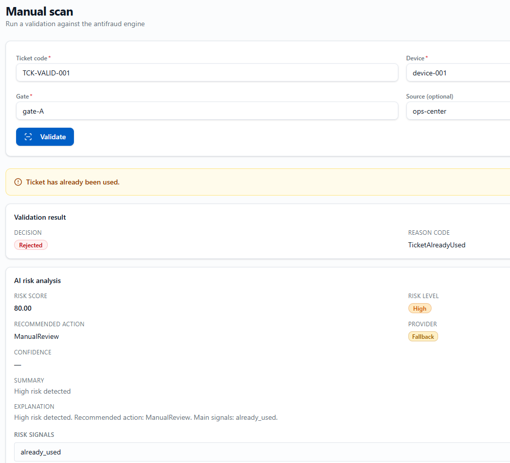

### Notifications
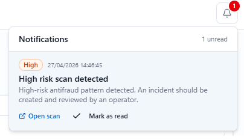

### Incidents List
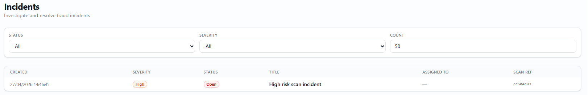

### Incident Detail
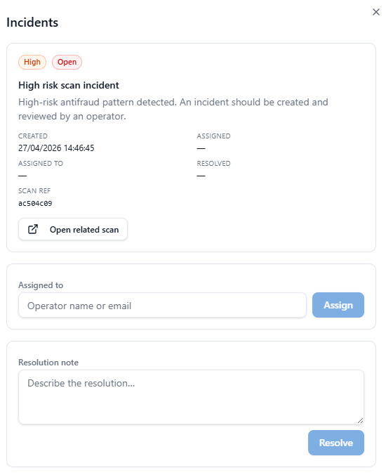

---

## 📱 Mobile Screenshots

### Home
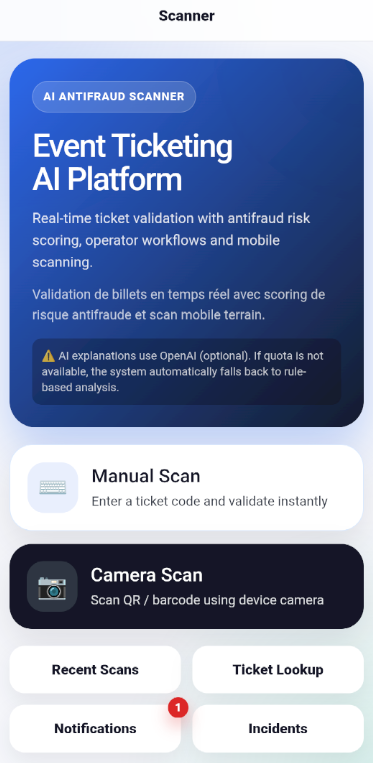

### Manual Scan
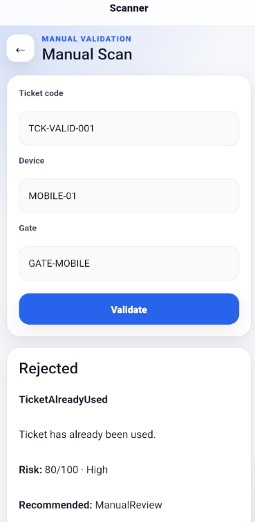

### Manual Scan
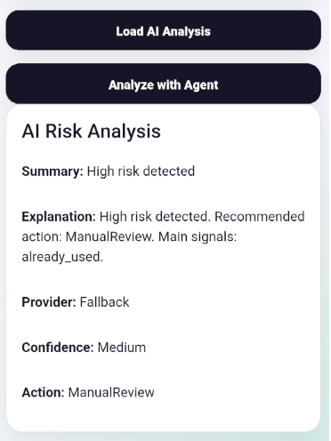

### Mobile Agent Decision
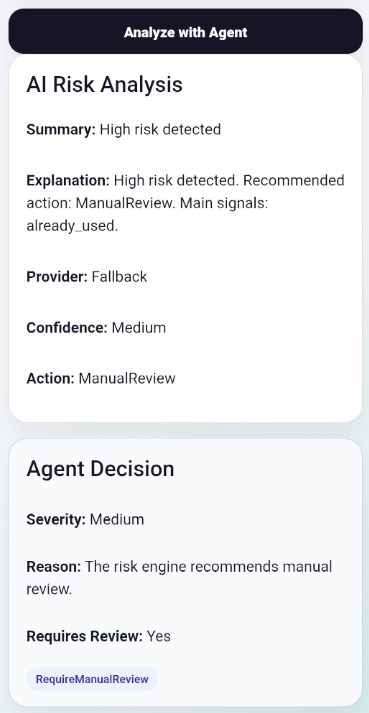

### Camera Scan
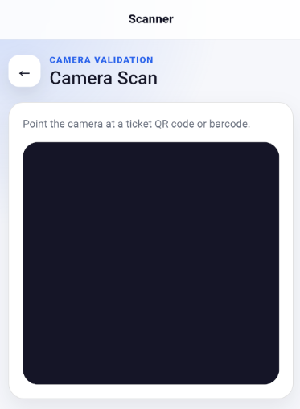

### Ticket Lookup
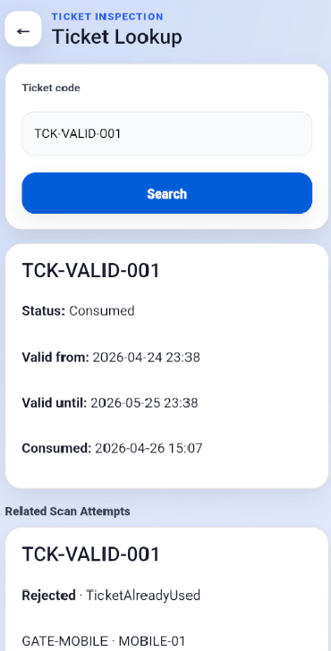

### Recent Scans
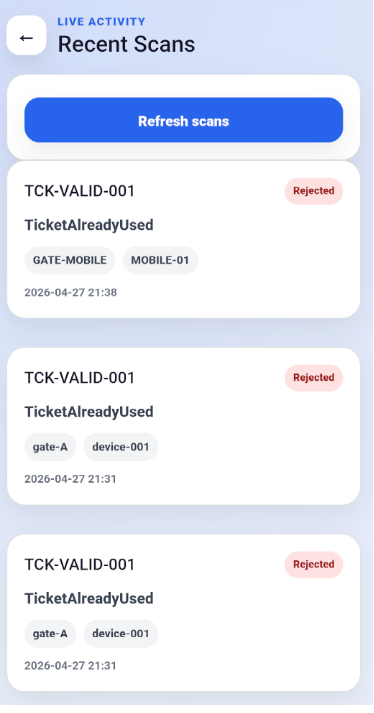

### Mobile Notifications
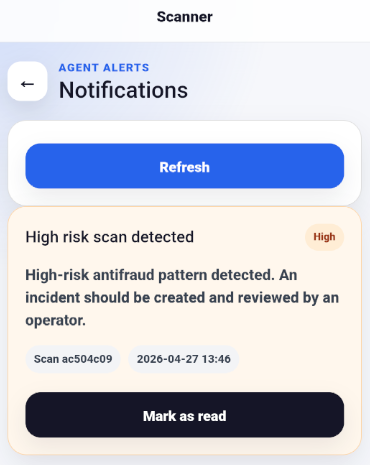

### Mobile Incidents
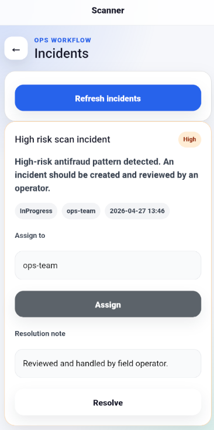

---

## 🚧 Roadmap

1. Real-time notifications (SignalR)  
2. Advanced fraud detection (behavioral patterns)  
3. Multi-event / multi-tenant support  
4. Analytics & reporting  

---

## Author

Rachid Bariz  
Senior Full-Stack .NET Architect